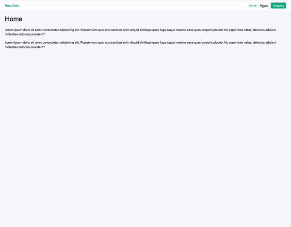

# Nuxt-Dojo

A shop for the ninjas ! <br/>

Have a look at it [here.](https://aquamarine-kleicha-0899ce.netlify.app)

# Description

This is a simple front-end project, built with nuxt, Tailwind, currencyApi and Netlify. It uses:
Routing, Layouts, Components, Tailwind, Fetch, Error pages, ;Metadata, Server routes and Env variables.

# Routing

Automatic routing in nuxt, based on the “pages” folder.

index.vue will be linked to the `“/”` route.

If using multiple pages, you can delete the app.vue file and create a index.vue in the pages folder

For a parametric route, use [] in the file name. Example : [id].vue in the “products” folder will be served when accessing /products/12.

The id params can then be accessed through: `useRoute().params`

The `NuxtLink` components allow to navigate between the different pages, without having to do a request to the server.
Note that the current NuxtLink (ie. the current page) has a active class, that enables styling - _`.router-link-exact-active`_

# Layouts

To create the default layout, create a file `default.vue` in the folder `layouts`.

Then, add the component `<slot/>` where you want the page output to be.

One can also create a custom layout for a given page. Then just create a `customLayout.vue`

and add this line in the `<script>` of the page you want to have the layout for:

```
definePageMeta({
    layout: "products",
  });
```

# Tailwind

To add tailwind, install it : `npm install --save-dev @nuxtjs/tailwindcss` and configure the config file according to the tailwind doc ([https://tailwindcss.nuxtjs.org/getting-started/setup](https://tailwindcss.nuxtjs.org/getting-started/setup)) :

```tsx
export default defineNuxtConfig({
  modules: ["@nuxtjs/tailwindcss"],
});
```

It is also possible to create one’s customed classes. To do so, create file : `assets/css/tailwind.css` and import the tailwinds comps:

```css
@tailwind base;
@tailwind components;
@tailwind utilities;

// now you can apply the styling

body {
  @apply bg-gray-50;
}

@layer components {
  .btn {
    @apply bg-[#12b488] text-white px-3 py-2 rounded-md text-sm;
  }
}
```

# Fetching Data

axios is not available anymore in the nuxt3 version. instead, we use the built-in `useFetch` method.

<aside>
☠️ Beware that fetching data occurs on the client side, but also on the server side during the first rendering!
This means you cannot access **client-specific values !**

</aside>

<aside>
☠️ useFetch won’t retry to refetch after the first data has been fetched. A key must be passed to the method, as a unique identifier of the “fetch action” we do. It can be for example the id of the product we are currently trying to fetch the data from.

</aside>
<br/>

# Components

It is possible to create some components, exactly like in Vue.js. The good news is that it is not necessary to import them ! But they need to be in the right folder: `components`

Then it is possible to pass some props. In the component itself, juste grab the prop

```js
const { product } = defineProps(["product"]);
```

# Errors

On the parametric routes, we should get a 404 error if the param is completely false. Instead, natively, Nuxt will try to render the component with the given param.

To do so, create an error.vue file at the root of the project.

# Meta data

This is globally configurable in `nuxt.config.ts`:

```js
export default defineNuxtConfig({
  ... ,
  app: {
    head: {
      title: "Nuxt Dojo",
      meta: [
        {
          name: "description",
          content: "fake eshop for ninjas",
        },
      ],
      link: [
        {
          rel: "stylesheet",
          href: "https://fonts.googleapis.com/icon?family=Material+Icons",
        },
      ],
    },
  },
```

It is also possible to custom it in a view, thanks to composable:

```js
<script setup>
  const { product } = defineProps(["product"]);

  useHead({
    title: "Nuxt Dojo | Merch",
    meta: [
      {
        name: "description",
        content: "brand new merch",
      },
    ],
  });
</script>
```

Or use Nuxt built-in components

```jsx
<Head>
    <Title> Nuxt Dojo | {{ product.title }} </Title>
    <Meta name="description" :content="product.description"></Meta>
  </Head>
```

<aside>
🔥 This allows to modify parametrically the metadata per page. Must be good3 for SEO (tbc)

</aside>

# Server routes

Create a file in `server`. For example, if you create the file Server/api/ninja.js, it will be possible to use this route, and make calls to the server.

Use the `defineEventHandler` function

```js
export default defineEventHandler(async (event) => {
  // handle query params
  //   const { name } = getQuery(event);

  // handle post data
  //   const { age } = await readBody(event);

  //   return {
  //     message: `Hello, ${name}, you are ${age} years old !`,
  //   };

  //api call with private key
  const apiKey = "XXX";
  const { data } = await $fetch(
    `https://api.currencyapi.com/v3/latest?apikey=${apiKey}`
  );

  return { data };
});
```

<aside>
🔥 Beware to use the method $fetch and not useFetch on server side

</aside>

# Env variables

How to use env variables in Nuxt?

create your `.env` file. Then go to your config file `nuxt.config.ts` and use :

```jsx
export default defineNuxtConfig({
  ...,
  runtimeConfig: {
    currencyKey: process.env.CURRENCY_API_KEY,
    public: {},
  },
});
```

Beware that the public values will be sent to the front end, creating a important security breach, if bad info is sent.

Then, in your file, you can access it with: `const { currencyKey } = useRuntimeConfig()`

## Resources

- [source](https://www.youtube.com/playlist?list=PL4cUxeGkcC9haQlqdCQyYmL_27TesCGPC)

- [Official documentation](https://nuxt.com/docs/getting-started)

- [Nuxt modules](https://modules.nuxtjs.org/)
